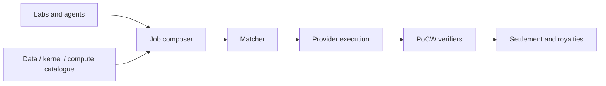

# Cogbazaar

**Source:** `ai-in-decentralized+ai/pandorapresentationblockchainua1-170923194636/`
**Domain:** `ai-decentralized`
**One-liner:** A decentralized bazaar that matches buyers to datasets, AI kernels, and GPU compute under proof-of-cognitive-work settlement so AI progress is priced as commodity work rather than oligopoly capacity.
**Wedge:** Independent AI labs and research consortia that need burst compute and third-party kernels without locking into a single cloud hyperscaler or closed model store.
**Positioning:** Pandora’s thesis maps Bitcoin→finance, Ethereum→contracts, and a cognitive layer→AI. Cogbazaar is that commercial layer: open markets for data, kernels, and compute, with “cognitive mining” (PoCW) and research incentives (PoR) replacing pure hash mining as the economic engine.

## Market research synthesis

### Thesis from source

The Pandora deck argues AI is existential for medicine and civilisation (cancer diagnosis, proteomics, lifetime prediction, drug discovery) yet progress since the 1950s is mostly more data and compute on familiar maths — and those inputs are oligopolised. Researchers lack direct economic incentives; compute spend still competes with Bitcoin hashing. The proposed remedy is open decentralized markets for big data, AI kernels, and computing power, plus incentives: **proof of cognitive work (PoCW) / cognitive mining** and **proof of research (PoR)** tied to h-index-like research support. Fear of uncontrolled AI (Musk/SkyNet framing) is answered with game theory and multi-agency: competition, trustless interaction, multiplicity, and decentralization — the same liberalisation pattern that contained human intelligence disparities. Blockchain supplies the trustless economic substrate; self-evolving AI agents will contract for compute to upgrade themselves. The masterplan is to stimulate research, make AI a commodity, align human–AI cooperation via incentives, and push toward many super-human AIs rather than a single kill-switched monopoly. Product implication: a marketplace that settles *useful cognitive work* and research contribution, not merely SHA hashes.

### Buyer & economic model

- **Primary buyer:** Head of AI Infrastructure or Research Ops at a mid-size AI lab; secondary is a GPU capacity provider seeking ai-native demand.
- **Users:** researchers, ML engineers, kernel publishers, compute miners/providers, research fund administrators, compliance reviewers.
- **Budget owner / value metric:** compute and data acquisition budget. Value metric is verified cognitive-work throughput per dollar and time-to-provision for a training or inference job.
- **Competing status quo:** hyperscaler spot GPUs; closed model hubs; academic cluster queues; Bitcoin-style mining with no AI output.

### Domain constraints

- **Regulatory / trust / safety:** dual-use model kernels, export controls, medical data licences, agent autonomy limits, kill-switch debates vs unstoppable infrastructure.
- **Data sensitivity:** datasets may be licensed for training only; kernels may embed proprietary weights; proofs must show work done without leaking training data.
- **Change-management realities:** researchers will not rewrite pipelines; Cogbazaar must wrap standard job specs (container + data ref + kernel ref) and settle after proof verification.

## Business requirements

- BR-1: Buyers must be able to purchase data access, kernel licences, and compute capacity as separate line items or as a bundled job.
- BR-2: Compute settlement must require a PoCW attestation that the contracted job ran to the declared specification, not merely that a hash was found.
- BR-3: Kernel publishers must receive usage-based compensation when their artefact is executed in a settled job.
- BR-4: Research-support pools (PoR) must allocate grants using transparent contribution metrics declared up front, not opaque curator whim alone.
- BR-5: Providers and buyers must remain multiple and substitutable — no exclusive single-provider routing for a given job class by default.
- BR-6: Job specs must support bringing compute to licensed data when export is forbidden.
- BR-7: Dangerous kernel classes must be flaggable and blockable by policy without taking down the entire market.
- BR-8: Disputes over failed PoCW must time-box to automatic refund or retry rules published in the job template.
- BR-9: Period statements must show spend across data, kernels, and compute for research accounting.
- BR-10: Agents acting as buyers must operate under a human-owned account with spend caps.
- BR-11: Marketplace take-rate must be disclosed separately from provider price.
- BR-12: Proof artefacts for settled jobs must be exportable for audit for the retention window.

## User stories

Canonical user stories live in sibling [USER_STORIES.md](USER_STORIES.md).

## System design

### Overview

Cogbazaar lists three commodity classes — datasets, AI kernels, and compute — and composes them into jobs. Matching produces a service agreement; providers execute; PoCW verifiers attest; settlement splits payment among data licensors, kernel publishers, and compute providers. Optional PoR pools disburse research support from stated metrics. Policy gates dual-use kernels and agent spend.

### Actors & boundaries

- **Actors:** buyer (human or capped agent), data licensor, kernel publisher, compute provider, PoCW verifier, fund admin, compliance, operator.
- **Trust boundary:** payloads stay with licensors/providers; bazaar holds catalogues, jobs, proofs, and settlement. Verifiers see proof artefacts, not necessarily full training data.
- **Human-in-the-loop points:** dual-use kernel approval; large spend approval; dispute adjudication; PoR disbursement approval.

### Core capabilities

1. **Catalogue** — data, kernels, compute offers.
2. **Job composition & matching** — bundle and bid.
3. **PoCW verification** — cognitive-work attestations.
4. **Settlement & royalties** — split payouts.
5. **PoR grant pools** — research incentive disbursement.
6. **Policy & dual-use gates** — category blocks, agent caps.
7. **Dispute & refund** — failed proof handling.
8. **Audit export** — job and proof packs.

### Conceptual data

- **Primary entities:** Listing, Kernel, DatasetRef, ComputeOffer, Job, PoCWAttestation, RoyaltyShare, GrantPool, PolicyRule, Dispute.
- **Critical events:** listing published, job matched, execution started, PoCW accepted, payout split, grant disbursed, policy block, dispute resolved.
- **Retention / audit needs:** jobs, proofs, and payouts retained for research and tax audit windows.

### Integrations (conceptual)

- **Systems of record:** lab experiment trackers, cloud GPU fleets, model registries, grant systems.
- **Upstream signals:** benchmark harnesses, licence registries, sanctions/dual-use lists.
- **Downstream actions:** container schedulers, wallet/payout rails, compliance reports.

### High-level architecture

### Success metrics

- **Leading:** jobs settled with valid PoCW; median match-to-start time; % spend on non-hyperscaler capacity.
- **Lagging:** researcher repeat purchase rate; kernel royalty GMV; dispute rate; dual-use incident count.

## OpenAPI skeleton

Canonical HTTP surface lives in sibling `openapi.yaml`. Summarize here:

- **Base path:** `/v1/...`
- **Auth:** API key and/or Bearer JWT (operator)
- **Resource groups:** Listings, Jobs, PoCWAttestations, RoyaltyShares, GrantPools, PolicyRules
