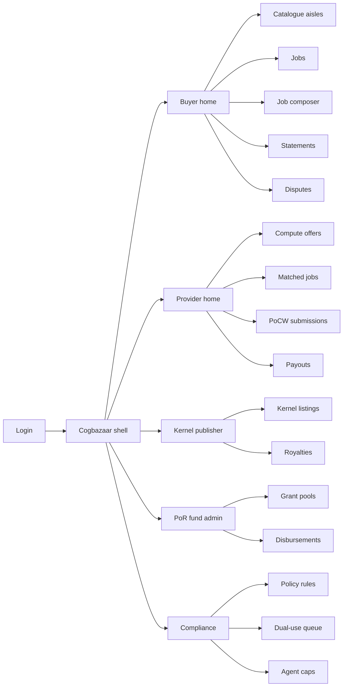
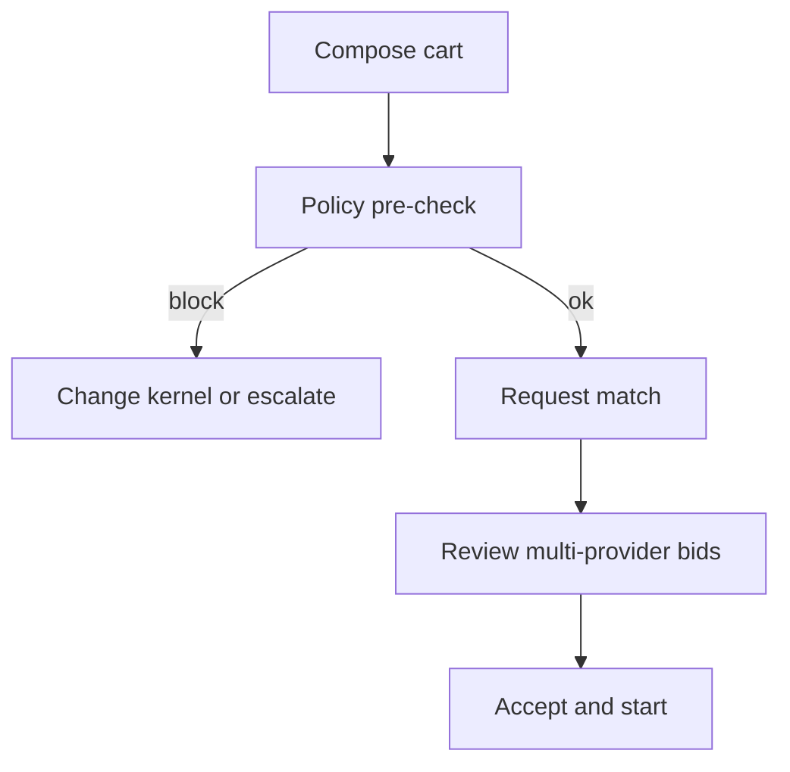
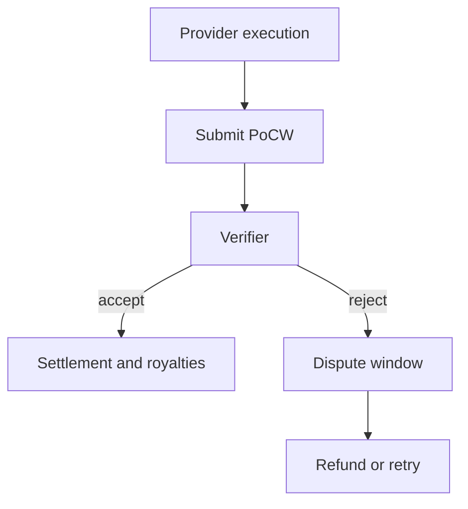

# Cogbazaar — Web app

**Product:** [PRODUCT.md](./PRODUCT.md)
**Primary surface:** Lab operator console (buyer workspace) + provider / publisher workspaces under one Cogbazaar shell
**Secondary surfaces:** PoR fund admin console; public PoCW attestation viewer (read-only proof export page)
**Design thesis:** Cogbazaar is a bazaar floor for cognitive commodities — data stalls, kernel stalls, and GPU stalls that compose into one settled job — not a hyperscaler console or a crypto wallet. The metaphor is a trading hall with three commodity aisles and a clearing desk where payment only unlocks when PoCW verifies useful work. Visual language is warm brass on deep ink (market lanterns, not neon chain-glow): settled cognitive work feels stamped and final; unmatched bids feel provisional; dual-use blocks feel sealed. The wordmark sits as a bazaar seal on every money-bearing screen so labs know whose cognitive-work clearing they trust.

## UX research synthesis

### Category peers (best-in-class)

- **Ocean Market / Aquarius discovery:** Dataset discovery with licence clarity and compute-to-data framing. Steal: licence class and “data stays put” affordances next to the listing; reject Ocean’s token-first wallet chrome as the primary buyer path.
- **SingularityNET AI Marketplace:** Service/agent catalogue with on-chain payment for AI calls. Steal: separable artefact purchase (kernel vs compute); reject opaque “AGI score” marketing tiles that bury settlement proofs.
- **Vast.ai / RunPod marketplace:** Dense GPU bid tables, filterable hardware, clear $/hr and job start latency. Steal: provider bid grids keyed to job spec; reject pure spot-GPU rental UX that never asks for cognitive-work attestation.
- **Hugging Face Hub (model cards + inference):** Kernel discovery with licence badges and usage telemetry. Steal: licence class badges and per-execution royalty visibility; reject social “like” metrics as the primary trust signal for settlement.

### Patterns to adopt / reject

- **Adopt:** Three-aisle catalogue (data / kernel / compute) composing into one cart; PoCW as a first-class nav object, not a buried receipt; disclosed take-rate separate from provider price; compute-to-data job templates when export is forbidden; dual-use category seals that block matching without taking down the market; agent spend caps with human-owned account ownership; PoR pool metrics declared up front.
- **Reject:** Hash-mining dashboards dressed as AI; single-provider exclusive routing UI; purple “AI insights” glow panels; wallet-seed onboarding as the only path; editable settlement totals after PoCW accept; chatbot as the job composer.

### Trust, density, and workflow constraints from PRODUCT.md

Labs need procurement density across three line items without rewriting pipelines (BR-1, change-management): job specs wrap container + data ref + kernel ref. Settlement is blocked until PoCW verifies the declared job, not a hash lottery (BR-2). Kernel royalties and data licences must split visibly (BR-3, BR-9, BR-11). Dual-use kernels are flaggable without market-wide downtime (BR-7). Agents buy only under human accounts with spend caps (BR-10). Proof packs must export for audit retention (BR-12). Multiplicity of providers is the default — the UI must never imply a single exclusive route for a job class (BR-5).

## Information architecture

### Nav model

### Roles → default home

| Role | Default home | Why |
|------|--------------|-----|
| Research lead / Research Ops | Buyer home — open jobs + PoCW pending | Daily experiment procurement (BR-1, BR-2) |
| ML engineer | Job composer | Compose container + refs without procurement theatre |
| Compute provider | Matched jobs queue | Earn on cognitive work, not hash lotteries |
| Kernel publisher | Royalties | Per-execution compensation (BR-3) |
| Research fund administrator | Grant pools | Transparent PoR metrics (BR-4) |
| Compliance officer | Dual-use queue | Block listed kernel classes (BR-7) |
| Platform operator | Statements + audit export | Take-rate disclosure and proof packs (BR-11, BR-12) |

### Cross-links to OpenAPI resources

| Nav area | OpenAPI tags / resources |
|----------|---------------------------|
| Catalogue aisles | Listings |
| Job composer, match, job detail | Jobs |
| PoCW queue and attestation viewer | PoCWAttestations |
| Kernel/data royalty statements | RoyaltyShares |
| PoR pools and disbursements | GrantPools |
| Dual-use blocks, agent caps | PolicyRules |

## Screen inventory

### Buyer home

- **Purpose:** Answer “what cognitive work is in flight, settled, or blocked — and am I paying for useful work?” in one composition.
- **Entry:** Post-login for buyer roles; alerts from PoCW failures.
- **Layout regions:** Brand + workspace switcher; KPI strip (jobs settled with valid PoCW, $/verified cognitive-work unit, median match-to-start, % non-hyperscaler spend); open jobs table; alerts rail (dual-use blocks, dispute deadlines, agent cap near-limit).
- **Primary actions:** Compose job; open pending PoCW; export period statement.
- **Empty / loading / error:** Empty = “list first dataset or browse compute aisle”; loading = skeleton KPIs; error = retry with request id.
- **BR / story ties:** BR-2, BR-5, BR-9; research lead stories.

### Catalogue — three aisles

- **Purpose:** Discover datasets, kernels, and compute as separate commodities with licence and policy seals.
- **Entry:** Buyer nav → Catalogue; deep link from job composer “add line”.
- **Layout regions:** Aisle switcher (Data / Kernels / Compute); filterable listing grid/table (licence class, dual-use flag, price, PoCW format support); listing detail drawer with licence terms, take-rate disclosure line, compute-to-data eligibility.
- **Primary actions:** Add to job cart; publish listing (provider/publisher); flag dual-use for review.
- **Empty / loading / error:** Empty aisle = publish CTA for providers; blocked listing shows sealed dual-use banner.
- **BR / story ties:** BR-1, BR-5, BR-6, BR-7, BR-11.

### Job composer (cart)

- **Purpose:** Bundle data + kernel + compute into one job spec with disclosed take-rate and optional compute-to-data mode.
- **Entry:** Buyer home CTA; catalogue “add to job”.
- **Layout regions:** Line-item panes (DatasetRef, Kernel, ComputeOffer); container/job-spec editor; spend forecast with take-rate line; agent vs human buyer indicator; policy pre-check panel.
- **Primary actions:** Save draft; request match; set agent spend cap inheritance; submit for matching.
- **Empty / loading / error:** Incomplete cart highlights missing aisle; policy block prevents match with reason code.
- **BR / story ties:** BR-1, BR-6, BR-10, BR-11; research lead cart story.

### Job match and detail

- **Purpose:** Show multi-provider bids against the job class; keep substitutability visible; track execution → PoCW → settlement.
- **Entry:** After match request; Jobs nav.
- **Layout regions:** Bid table (multiple providers); selected route with “why this provider”; execution timeline; PoCW status; royalty split preview; dispute affordance.
- **Primary actions:** Accept bid set; cancel; open PoCW; open dispute.
- **Empty / loading / error:** No bids = widen spec or wait; exclusive single-route UI never defaulted.
- **BR / story ties:** BR-5, BR-2, BR-8.

### PoCW attestation workspace

- **Purpose:** Make cognitive-work proof the clearing event — accept, reject, or escalate with exportable artefacts.
- **Entry:** Job detail; provider PoCW submissions; public attestation deep link (read-only).
- **Layout regions:** Spec vs claimed execution diff; proof artefact pane; verifier result; accept/reject with reason; export pack control.
- **Primary actions:** Accept PoCW; reject → dispute/refund path; export audit pack.
- **Empty / loading / error:** Pending = waiting pulse; failed format = clear PoCW schema help for providers.
- **BR / story ties:** BR-2, BR-8, BR-12.

### Statements and royalty ledger

- **Purpose:** Period accounting across data, kernels, and compute with royalty shares and disclosed take-rate.
- **Entry:** Buyer Statements; publisher Royalties; provider Payouts.
- **Layout regions:** Append-only settlement rows; filters by job/period/commodity; take-rate line; royalty share breakdown; export.
- **Primary actions:** Export statement; drill to PoCW pack; open dispute on row.
- **Empty / loading / error:** Empty period = no settled cognitive work; settled rows visually locked.
- **BR / story ties:** BR-3, BR-9, BR-11, BR-12.

### Provider compute offers and matched queue

- **Purpose:** Bid capacity against job specs and know which PoCW format unlocks payment.
- **Entry:** Provider login default.
- **Layout regions:** Offer editor (hardware, price, supported PoCW formats); matched jobs queue; clear PoCW format docs pane; payout calendar.
- **Primary actions:** Publish offer; submit PoCW; withdraw bid.
- **Empty / loading / error:** Empty queue = healthy idle with “bid on open jobs” CTA.
- **BR / story ties:** Compute provider stories; BR-2.

### Kernel publisher royalties

- **Purpose:** Per-execution compensation and licence class controls (research-only vs commercial).
- **Entry:** Publisher home.
- **Layout regions:** Kernel list with licence badges; royalty ledger; dual-use status; licence restriction editor.
- **Primary actions:** Publish kernel; set licence class; export royalty statement.
- **Empty / loading / error:** No kernels = guided publish with dual-use self-attestation.
- **BR / story ties:** BR-3, BR-7; kernel publisher stories.

### PoR grant pools

- **Purpose:** Transparent research-support allocation from declared metrics, not opaque curator whim alone.
- **Entry:** Fund admin home.
- **Layout regions:** Pool list with declared metrics; applicant/contribution table; disbursement preview; approval rail.
- **Primary actions:** Create pool; declare metrics; approve/deny disbursement with audit note.
- **Empty / loading / error:** Empty = create first pool with metric template.
- **BR / story ties:** BR-4; fund administrator stories.

### Policy and dual-use gates

- **Purpose:** Flag and block dangerous kernel classes and enforce agent spend caps without market shutdown.
- **Entry:** Compliance home; alerts from catalogue.
- **Layout regions:** Policy rule list; dual-use review queue; agent account caps table; block impact preview (jobs affected, market still live).
- **Primary actions:** Add rule; approve/block kernel class; adjust agent cap; notify owners.
- **Empty / loading / error:** Empty queue = healthy message; rule conflict shown inline.
- **BR / story ties:** BR-7, BR-10; compliance stories.

### Disputes (failed PoCW)

- **Purpose:** Time-boxed refund or retry per published job template rules.
- **Entry:** Job detail; statement row; alerts.
- **Layout regions:** Queue with deadline; dual evidence (buyer spec vs provider proof); resolution log; refund/retry preview.
- **Primary actions:** Submit evidence; accept auto-rule; escalate.
- **Empty / loading / error:** Empty = no open disputes; expired = auto-resolve state locked.
- **BR / story ties:** BR-8.

## Key flows

1. **Compose and match a cognitive job** — pick data + kernel + compute → policy pre-check → disclose take-rate → match multi-provider → start; failure: dual-use block or agent cap exceeded.

2. **Execution to PoCW settlement** — provider runs job → submits PoCW → verifier accept → royalty split → statement append; failure: reject → time-boxed dispute → refund or retry (BR-8).

3. **Compute-to-data job** — licensed data forbids export → job template brings compute to data → PoCW still required without leaking training set (BR-6).

4. **PoR disbursement** — declare pool metrics → score contributions → human approve disbursement → audit trail (BR-4).

5. **Dual-use kernel gate** — listing flagged → compliance review → block matching for class → market remains open for other aisles (BR-7).

## Design system

### Tokens (CSS variables)

- `--color-ink: #F2EDE4` — primary text on deep ground
- `--color-bazaar-950: #0E0C0A` — app ground
- `--color-bazaar-900: #1A1612` — panels
- `--color-bazaar-700: #3D342C` — rules
- `--color-brass: #C4A35A` — market accent / brand seal
- `--color-brass-dim: #7A6430` — brass on dark
- `--color-ledger: #6FBF8B` — PoCW accepted / settled
- `--color-amber: #D4A017` — provisional match / dispute clock
- `--color-seal: #C45C4A` — dual-use block / policy seal
- `--color-steel: #9A8F82` — secondary labels
- `--font-display: "Source Serif 4", serif` — bazaar titles and job names (not Inter)
- `--font-body: "IBM Plex Sans", sans-serif` — console body
- `--font-mono: "IBM Plex Mono", monospace` — job ids, PoCW hashes, royalty lines
- `--space-1`…`--space-8`: 4px scale
- `--radius-sm: 3px`; `--radius-md: 6px` — stall-edge sharpness, not pill-heavy
- `--motion-stamp: 200ms ease-out` — PoCW accept stamp
- `--motion-lantern: 280ms ease-in-out` — aisle switch crossfade
- `--motion-seal: 160ms ease-out` — dual-use seal drop
- Atmosphere: subtle warm noise and horizontal stall-divider lines on bazaar-900; soft brass rim light on money screens — no purple chain-glow, no stock “AI brain” heroes in console.

### Typography & brand

- Serif display for aisle titles and settled job names; mono for PoCW ids and statement lines.
- Cogbazaar wordmark left of shell chrome on every settlement-bearing view; never replaced by generic “Dashboard” as the strongest mark.
- Login/marketing shell: brand as hero-level signal; one headline (“Settle useful cognitive work”); one CTA — no KPI collage.

### Do / don’t

- **Do:** Keep three aisles visually distinct; lock settled PoCW rows; show take-rate as one line; show multiple provider bids by default; seal dual-use without greying out the whole market.
- **Don’t:** Purple AI gradients; hash-rate as primary KPI; single-provider forced route; editable royalty totals; card grids for static market stats; emoji status.

### Accessibility & domain trust cues

- Contrast AA+ on brass/ledger/seal against bazaar ground; status never colour-only — settled rows show stamp icon + “PoCW settled” text.
- Live regions announce PoCW accept/reject and dispute deadline changes.
- Focus order follows commodity flow: catalogue → composer → match → PoCW → statement.
- Public attestation page exposes machine-readable proof for auditors.

## Component patterns

- **CommodityAisleSwitch** — Data / Kernel / Compute with distinct stall chrome.
- **JobCartLine** — line item with licence class and take-rate disclosure.
- **PoCWStampRow** — attestation state (pending / accepted / rejected / disputed) with export affordance.
- **MultiBidTable** — substitutable provider bids; no exclusive default route.
- **DualUseSeal** — settlement/match-blocking kernel class banner.
- **AgentSpendCapMeter** — human-owned account remaining capacity.
- **RoyaltySplitBar** — data / kernel / compute / take-rate shares.
- **PoRMetricDeclaration** — pool metrics declared before disbursement.
- **ComputeToDataBadge** — job template where data does not leave licensor.

## Out of scope for v1 web

- On-chain wallet-only onboarding as sole auth; Bitcoin-style mining UI; full model training IDE; headset/agent-native UI beyond capped API buyers; white-label lab portals; replacement of lab experiment trackers (integration only); consumer end-user AI chat.
